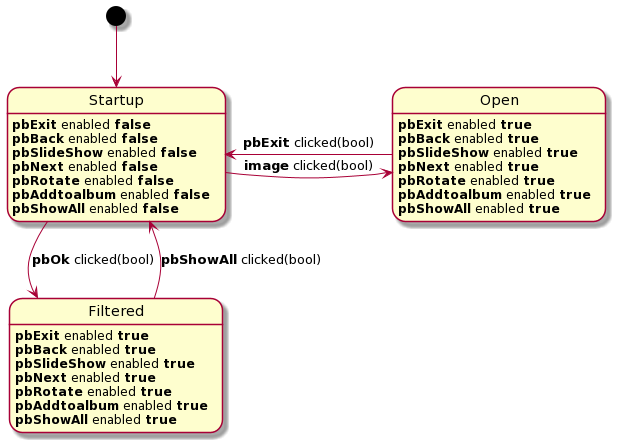
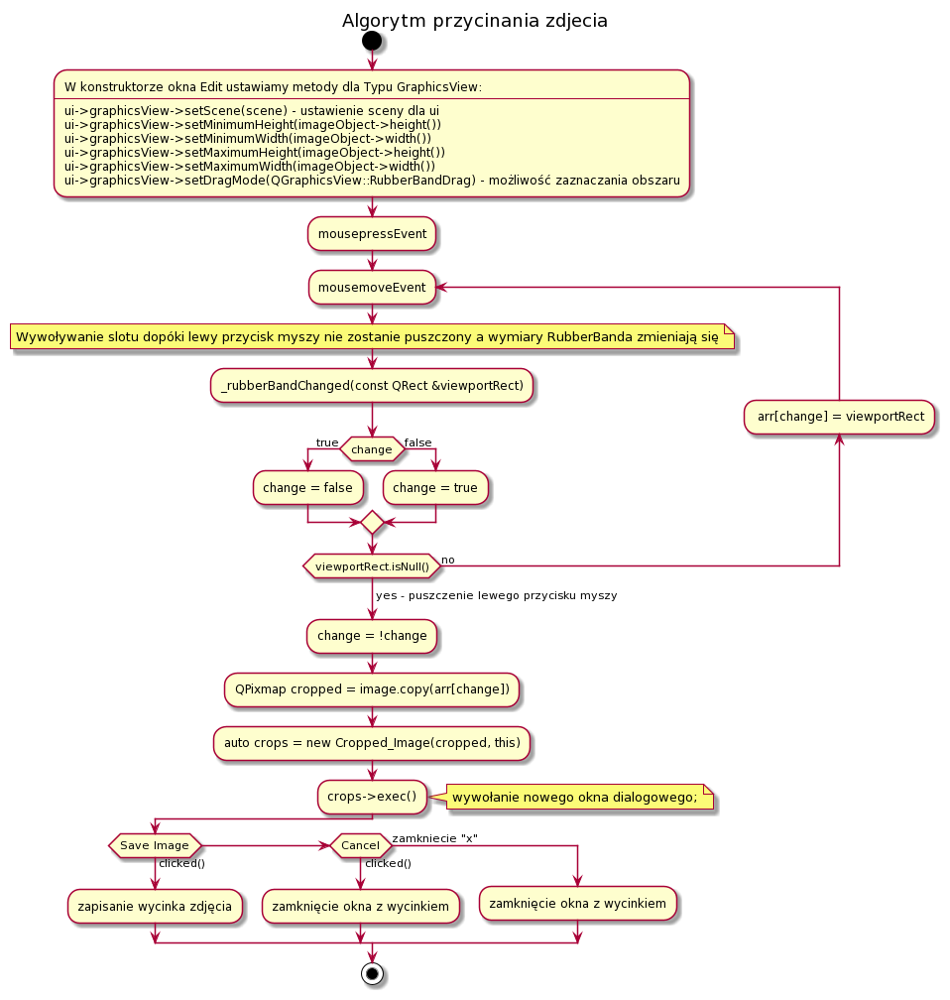

# Image gallery application #

This gui application was developed by students from applied computer science students from AGH UST.

### What does this application do? ###

* Finds all of the images on your hard drive
* Filters the images on the chosen condition (date of creation, time, file format)
* Provides full screen slide show
* Allows album creation with specified name and description
* Can add image effects, such as conversion to shades of gray
* Crops images to selected size
* Rotates images

### Configuration ###
* Install qtcreator
[Qt documentation](https://www.qt.io/)
* How to build the code:  
``
! rm -rf build-Project
``  
``
! mkdir build-Project
``  
``
! cd build-Project && qmake ../Project
``  
``
! cd build-Project && make -j4
``  
``
! build-Project/Project
``

* Uml diagrams

  

### Contribution guidelines ###

* Writing tests
* Code review
* Other guidelines